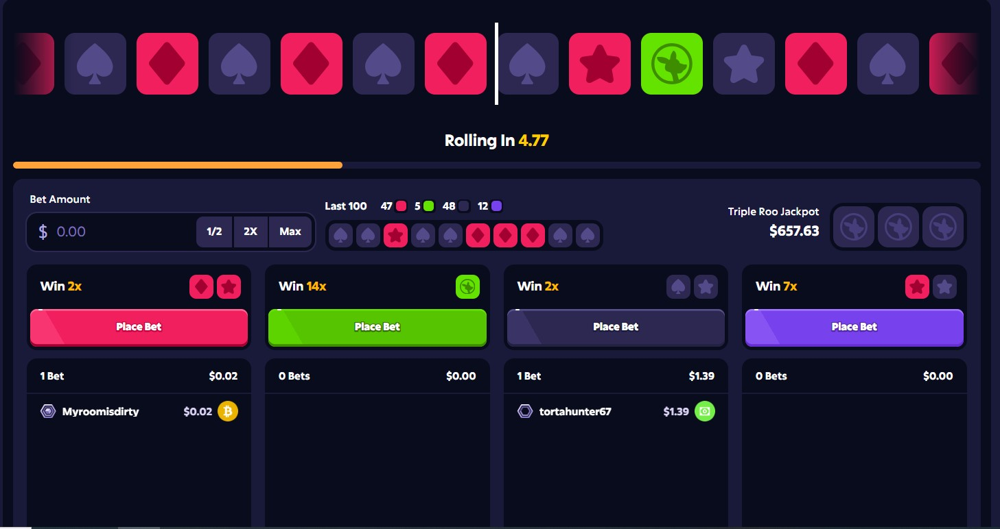
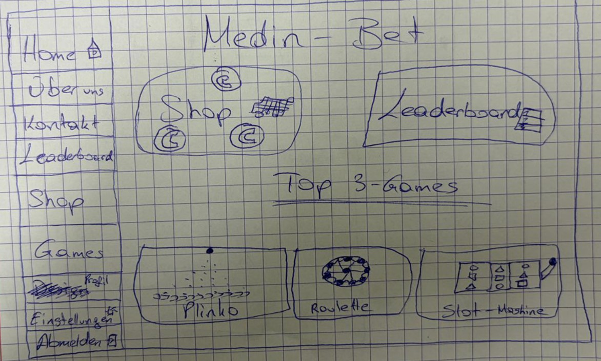
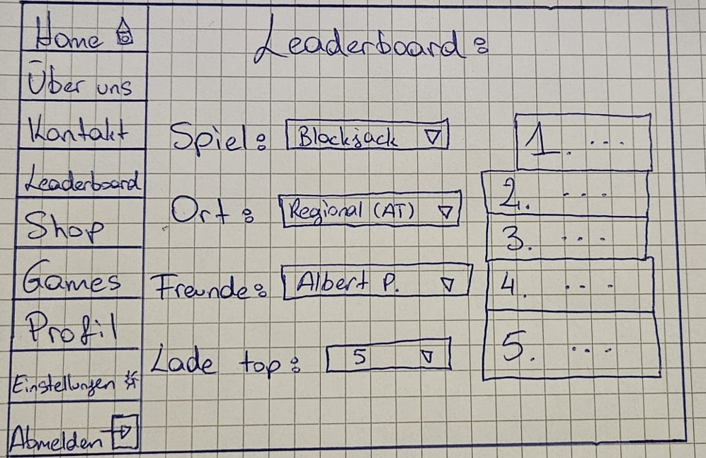
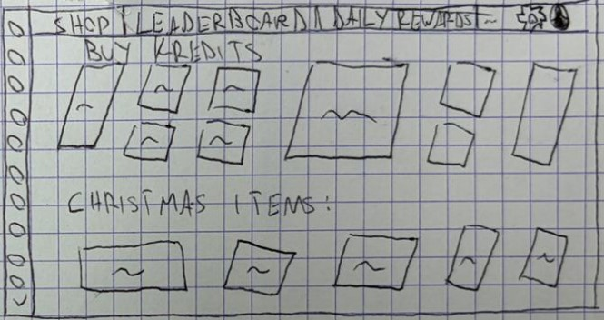
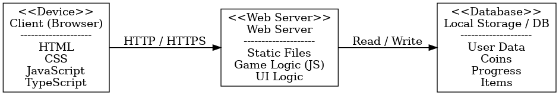
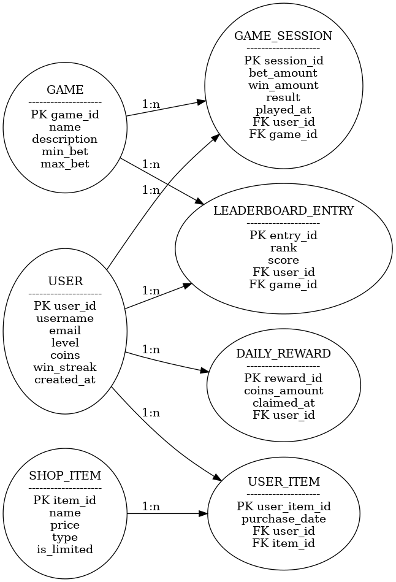

# Online Casino – Pflichtenheft

**Projektteam:** Metehan, David, Aldin, Sulejman, Hamlet, Osama aus der 3AHIF

---

## Inhaltsverzeichnis

- [1. Ausgangslage](#1-ausgangslage)
  - [1.1 Ist-Situation](#11-ist-situation)
  - [1.2 Verbesserungspotenziale](#12-verbesserungspotenziale)
- [2. Zielsetzung](#2-zielsetzung)
- [3. Funktionale Anforderungen](#3-funktionale-anforderungen)
  - [3.1 Use Case A – Homepage](#31-use-case-a--homepage)
  - [3.2 Use Case B – Leaderboard](#32-use-case-b--leaderboard)
  - [3.3 Use Case C – Shop](#33-use-case-c--shop)

- [5. Mengengerüst](#5-mengengerüst)

---

## 1. Ausgangslage

Casinos gibt es meistens nur an bestimmten Orten und zu bestimmten Zeiten.  
Oft braucht man dort auch viel Geld. Für viele Leute ist das daher nicht praktisch.

Online-Casinos gibt es zwar, aber viele davon sind kompliziert aufgebaut oder kosten Geld.  
Deshalb wollen wir ein einfaches Online-Casino als Webprojekt umsetzen.

---

### 1.1 Ist-Situation

- Casinos sind ortsgebunden  
- Nicht jederzeit verfügbar  
- Meist hoher Geldeinsatz notwendig  
- Kaum Anpassungsmöglichkeiten  
- Online-Angebote oft unübersichtlich oder kostenpflichtig  

---

### 1.2 Verbesserungspotenziale

#### Vorteile des Projekts

- Jederzeit spielbar (browserbasiert)  
- Komplett kostenlos  
- Mehrere Spiele auf einer Plattform  
- Moderne, übersichtliche Benutzeroberfläche  
- Fortschritt wird gespeichert

#### Mögliche Probleme

- Keine Serverfunktionen  
- Teilweise komplexe Spiellogik  
- Erhöhter Zeitaufwand durch mehrere Spiele  

#### Lösungen

- Speicherung im Server
- Wichtige Funktionen zuerst umsetzen
- Schrittweise Umsetzung  

#### SWOT-Analyse

| **Stärken** | **Schwächen** |
|------------|---------------|
| Motivierendes Projekt | Keine Serveranbindung |
| Gute Übung für HTML/CSS/JS/TS | Daten nur lokal |
| Mehrere Spielarten | Teilweise komplexe Logik |

| **Chancen** | **Risiken** |
|------------|-------------|
| Gutes Portfolio-Projekt | Zeitmangel |
| Erweiterbar | Fehleranfällige Spielmechaniken |

---

## 2. Zielsetzung

Ziel ist es, ein einfaches Online-Casino zu erstellen, das komplett im Browser läuft.  
Der Benutzer soll verschiedene Spiele spielen und Coins gewinnen oder verlieren können.

### Hauptfunktionen

- Benutzerprofil  
- Coins-System  
- Daily Reward  
- Shop für Skins / Themes  
- Level- & Win-Streak-System  
- Leaderboard  

### Spiele

- Mines  
- Roulette  
- Blackjack  
- Plinko  
- Slot Machine  

## Slot-Machine Übersicht

### Definition
Ein Spielautomat mit einem Raster aus Symbolen, z.B:
- 3×1  
- 3×3  
- 7×3  

### Ablauf
1. Spieler drückt **„Spin“**  
2. Alle Reihen und Spalten drehen sich gleichzeitig  
3. Die Drehung stoppt nacheinander und zeigt das Ergebnis  

### Gewinnlogik
- Abhängig davon, wie viele gleiche Symbole verbunden sind  
- Berechnet den Gewinn des Spielers  

### Umsetzung
  - Animationen für die drehenden Symbole  
  - Algorithmus für Erkennung der Kombinationen und Gewinnberechnung

## Mines Übersicht

## Definition
Mines ist ein einfaches Raster-Spiel mit wählbaren Größen, z.B:

- 9×9  
- 12×12  
- 18×18  

## Ablauf
1. Bomben werden zufällig im Grid verteilt  
2. Spieler klickt Felder an und versucht, nur sichere Felder zu treffen.
3. Jeder sichere Klick erhöht den Gewinn
4. Ein Bombenklick beendet die Runde

## Gewinnlogik
Multiplikatoren pro sicherem Feld:

- **9×9:** 1.15×  
- **12×12:** 1.10×  
- **18×18:** 1.05×  

**Beispiel:**  
100 coins Einsatz + 3 sichere Klicks im 9×9 → **145 coins Gewinn**

### Umsetzung
- einfach, haben wir letztes Jahr in WMC gemacht

##  Roulette Übersicht

### Definition
Spieler setzen auf Zahlen oder Farben und die Kugel im Rad die Gewinnzahl bestimmt.

### Ablauf
1. Spieler setzen auf dem Tischl.  
2. Das Rad dreht sich, Kugel wird eingeworfen.  
3. Die Kugel landet auf einer Zahl (0–36).  
4. Einsätze werden falls richtiges Setzen ausgezahlt. 

### Gewinnlogik
Auszahlung hängt von der Setzung ab.  
Beispiel: 10 € auf Zahl 12 → Kugel landet auf 12: **350 € Gewinn**.

## Umsetzung
- Roulette-Rad + Kugel animieren  
- Zufallszahl 0–36 generieren  
- Setzfelder  
- Gewinne entsprechend auszahlen

## Blackjack Übersicht

### Definition
Ein Kartenspiel, bei dem Spieler versuchen, näher an **21** zu kommen als der Dealer, ohne diese Zahl zu überschreiten.

### Ablauf
1. Spieler und Dealer erhalten Startkarten.  
2. Spieler entscheidet: **Hit**, **Stand**, **Double**, **Split** (falls möglich).  
3. Dealer zieht Karten bis mindestens 17.  
4. Werte werden verglichen, nähster Spieler gewinnt.

### Grundregeln
- Zahlenkarten = ihr Wert  
- Bildkarten = 10  
- Ass = 1 oder 11  
- Blackjack (Ass + 10er-Karte) zahlt meist **3:2**

### Gewinnlogik
Spieler gewinnt, wenn:
- Seine Hand näher an 21 ist als die des Dealers  
- Der Dealer über 21 geht (**Bust**)  
- Spieler Blackjack hat

### Umsetzung
- Kartendeck generieren/mischen  
- Kartenlogik + Handwerte  
- Spieleraktionen (Hit/Stand/Double/Split)  
- Dealer-Automation (zieht bis 17)  
- Rundenauswertung + Auszahlung

## Plinko Übersicht

## Definition
Ein Ball fällt von oben und an Pins abprallt, bevor er in unten liegenden Fächern landet, die Punkte vergeben.

## Ablauf
1. Spieler wählt Einsatz und Fall-Position des Balls.  
2. Ball fällt durch das Pin-Gitter, prallt an Pins ab.  
3. Ball landet in einem Punktefach, Punkte werden angezeigt.  
4. Optional: mehrere Bälle nacheinander, Reset-Funktion.

## Gewinnlogik
- Punkte hängen vom Fach ab, in dem der Ball landet.  
- Risiko-Stufe einstellbar: höhere Stufe → größere mögliche Punkte, aber höhere Schwankungen.

## Umsetzung
- Physikalische Schwerkraft für den Ball simulieren.  
- Kollisionserkennung mit Pins.  
- Animationen: flüssige Bewegung, Aufleuchteffekte bei Kollisionen.  

---

## 3. Funktionale Anforderungen

---

### 3.1 Use Case A – Homepage

**Beschreibung:**  
Die Startseite ist die erste Seite nach dem Öffnen der Website.
Hier bekommt der Benutzer einen schnellen Überblick über das Casino.

**Funktionen:**

- Navigation (Home, Shop, Games, Profil usw.)
- Anzeige des aktuellen Coin-Stands
- Zugriff auf den Shop
- Anzeige des Leaderboards
- Anzeige der Top 3 Games
- Schneller Einstieg in den Top Games

**Ziel:**     
Der Benutzer soll schnell verstehen, was möglich ist, und direkt spielen können.

---

### 3.2 Use Case B – Leaderboard

**Beschreibung:**  
Im Leaderboard sieht der Benutzer mithilfe der Filter, wie gut er im Vergleich zu anderen Spielern ist.  Er kann sich ein beliebiges Spiel und seine Freunde auswählen, wie auch der aktuelle Ort und wie lang er die Liste haben will.

**Funktionen:**

- Anzeige der Top-Spieler
- Sortierung beliebeige Filter 
- Eigene Position wird angezeigt
- Auswahl von Spielen
- Übersichtliche Listenansicht

**Ziel:**     
Der Benutzer soll motiviert werden, öfter zu spielen und besser zu werden.

---

### 3.3 Use Case C – Shop

**Beschreibung:**  
Im Shop kann der Benutzer seine Coins für Skins, Designs oder Extras ausgeben.

**Funktionen:**
- Anzeige verfügbarer Items 
- Anzeige des Preises in Coins  
- Kaufen von Items
- Anzeige gekaufter Items  
- Spezial-Items (z. B. Events oder Themen) 

**Ziel:**            
Der Benutzer soll Coins sinnvoll verwenden und sein Casino personalisieren können.

---

## 5. Mengengerüst

- **Benutzeranzahl:**  
  - ca. **1.000+ Benutzer** 
  - optimales Wachstum mit Werbung

- **Datenmenge pro Benutzer:**  
  - Profil, Coins, Fortschritt  
  - unter **3 MB pro Benutzer**

- **Serveranfragen:**  
  - ca. 10-30 Serveranfragen pro Sitzung je nach Gebrauch (z. B. Laden von Daten, Seiten, Spielen, Leaderboards)

## 6. Systemarchitektur

### 6.1 Deployment-Diagramm

### 6.2 Datenmodell

