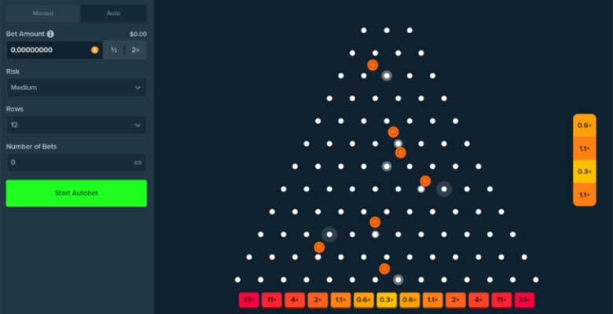

# Projektantrag – Online Casino  
David, Aldin, Sulejman, Hamlet, Metehan, Osama — 3AHIF

# 1. Ausgangslage

## 1.1 Ist-Situation  

Physische Casinos vorhanden:

* Ortsgebunden

* Nicht jederzeit verfügbar

* Oft teuer / hoher finanzieller Einsatz

* Keine Anpassungsmöglichkeiten

Online-Casinos existieren, aber komplex oder kostenpflichtig

## 1.2 Verbesserungspotenziale

* Einfacher Zugang ohne Ort/Öffnungszeiten

* Komplett kostenlos spielbar

* Daily Rewards

* Lokale Speicherung von Fortschritt

* Mehrere Spiele in einer Plattform

* Modernes, übersichtliches UI

---

# 2. Zielsetzung  
Ziel ist die Erstellung eines einfachen, vollständig clientseitigen Online-Casinos.  
Das System soll mehrere Minispiele enthalten und dem Benutzer Coins, Belohnungen und personalisierbare Elemente bieten.  

## Wichtige Funktionen:
- Benutzerprofil  
- Coins-System  
- Daily Reward  
- Shop für Skins/Themes  
- Win-Streak & Level-System
- Leaderboard
- Spiele: **Plinko, Mines, Slot Machine, Blackjack, Roulette**

## Slot-Machine Übersicht

### Definition
Ein Spielautomat mit einem Raster aus Symbolen, z.B:
- 3×1  
- 3×3  
- 7×3  

### Ablauf
1. Spieler drückt **„Spin“**  
2. Alle Reihen und Spalten drehen sich gleichzeitig  
3. Die Drehung stoppt nacheinander und zeigt das Ergebnis  

### Gewinnlogik
- Abhängig davon, wie viele gleiche Symbole verbunden sind  
- Berechnet den Gewinn des Spielers  

### Umsetzung
  - Animationen für die drehenden Symbole  
  - Algorithmus für Erkennung der Kombinationen und Gewinnberechnung

## Mines Übersicht

## Definition
Mines ist ein einfaches Raster-Spiel mit wählbaren Größen, z.B:

- 9×9  
- 12×12  
- 18×18  

## Ablauf
1. Bomben werden zufällig im Grid verteilt  
2. Spieler klickt Felder an und versucht, nur sichere Felder zu treffen.
3. Jeder sichere Klick erhöht den Gewinn
4. Ein Bombenklick beendet die Runde

## Gewinnlogik
Multiplikatoren pro sicherem Feld:

- **9×9:** 1.15×  
- **12×12:** 1.10×  
- **18×18:** 1.05×  

**Beispiel:**  
100 coins Einsatz + 3 sichere Klicks im 9×9 → **145 coins Gewinn**

### Umsetzung
- einfach, haben wir letztes Jahr in WMC gemacht

##  Roulette Übersicht

### Definition
Spieler setzen auf Zahlen oder Farben und die Kugel im Rad die Gewinnzahl bestimmt.

### Ablauf
1. Spieler setzen auf dem Tischl.  
2. Das Rad dreht sich, Kugel wird eingeworfen.  
3. Die Kugel landet auf einer Zahl (0–36).  
4. Einsätze werden falls richtiges Setzen ausgezahlt. 

### Gewinnlogik
Auszahlung hängt von der Setzung ab.  
Beispiel: 10 € auf Zahl 12 → Kugel landet auf 12: **350 € Gewinn**.

## Umsetzung
- Roulette-Rad + Kugel animieren  
- Zufallszahl 0–36 generieren  
- Setzfelder  
- Gewinne entsprechend auszahlen

## Blackjack Übersicht

### Definition
Ein Kartenspiel, bei dem Spieler versuchen, näher an **21** zu kommen als der Dealer, ohne diese Zahl zu überschreiten.

### Ablauf
1. Spieler und Dealer erhalten Startkarten.  
2. Spieler entscheidet: **Hit**, **Stand**, **Double**, **Split** (falls möglich).  
3. Dealer zieht Karten bis mindestens 17.  
4. Werte werden verglichen, nähster Spieler gewinnt.

### Grundregeln
- Zahlenkarten = ihr Wert  
- Bildkarten = 10  
- Ass = 1 oder 11  
- Blackjack (Ass + 10er-Karte) zahlt meist **3:2**

### Gewinnlogik
Spieler gewinnt, wenn:
- Seine Hand näher an 21 ist als die des Dealers  
- Der Dealer über 21 geht (**Bust**)  
- Spieler Blackjack hat

### Umsetzung
- Kartendeck generieren/mischen  
- Kartenlogik + Handwerte  
- Spieleraktionen (Hit/Stand/Double/Split)  
- Dealer-Automation (zieht bis 17)  
- Rundenauswertung + Auszahlung

## Plinko Übersicht

## Definition
Ein Ball fällt von oben und an Pins abprallt, bevor er in unten liegenden Fächern landet, die Punkte vergeben.

## Ablauf
1. Spieler wählt Einsatz und Fall-Position des Balls.  
2. Ball fällt durch das Pin-Gitter, prallt an Pins ab.  
3. Ball landet in einem Punktefach, Punkte werden angezeigt.  
4. Optional: mehrere Bälle nacheinander, Reset-Funktion.

## Gewinnlogik
- Punkte hängen vom Fach ab, in dem der Ball landet.  
- Risiko-Stufe einstellbar: höhere Stufe → größere mögliche Punkte, aber höhere Schwankungen.

## Umsetzung
- Physikalische Schwerkraft für den Ball simulieren.  
- Kollisionserkennung mit Pins.  
- Animationen: flüssige Bewegung, Aufleuchteffekte bei Kollisionen.  

# 3. Chancen und Risiken  
Das Projekt bietet eine gute Gelegenheit, HTML, CSS, JavaScript und TypeScript in einem größeren Projekt sinnvoll einzusetzen.  
Es verbindet Spiellogik, UI und Datenverwaltung in einer einzigen Webanwendung.

### SWOT-Analyse

**Stärken:**  
- motivierend    
- interessant  
- mit Client-Technologien umsetzbar  

**Schwächen:**  
- keine echten Serverfunktionen  
- Daten nur lokal verfügbar  

**Chancen:**  
- sehr gutes Portfolio-Projekt  
- erweiterbar für später

**Risiken:**  
- Zeitaufwand für mehrere Spiele  
- teilweise komplexe Logik  

**Gegenmaßnahmen:**  
- zunächst nur grundlegende Funktionen  
- klare Priorisierung  

---

# 4. Planung

### Feature-Priorisierung
1. Benutzerprofil + Coins  
2. Mines (erstes Spiel)  
3. Daily Reward + Shop  
4. Themes/Skins  
5. Plinko  
6. Slot Machine  
7. Blackjack & Roulette  

### Meilensteine  

#### **Meilenstein 1 – Basis & Grundfunktionen 07.04.2026** 
- Konzept, Layout, Struktur  
- Benutzerprofil + Coins-System  
- Mines, Roulette

#### **Meilenstein 2 – Personalisierung 26.05.2026**
- Daily Reward  
- Shop  
- Themes/Skins  
- Blackjack

#### **Meilenstein 3 – Erweiterungen 23.06.2026**
- Weitere Spiele (Plinko, Slot Machine)  
- Verbesserungen & Optimierungen 
